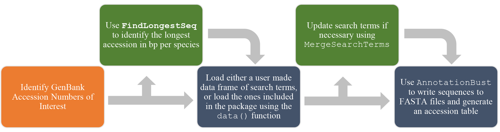
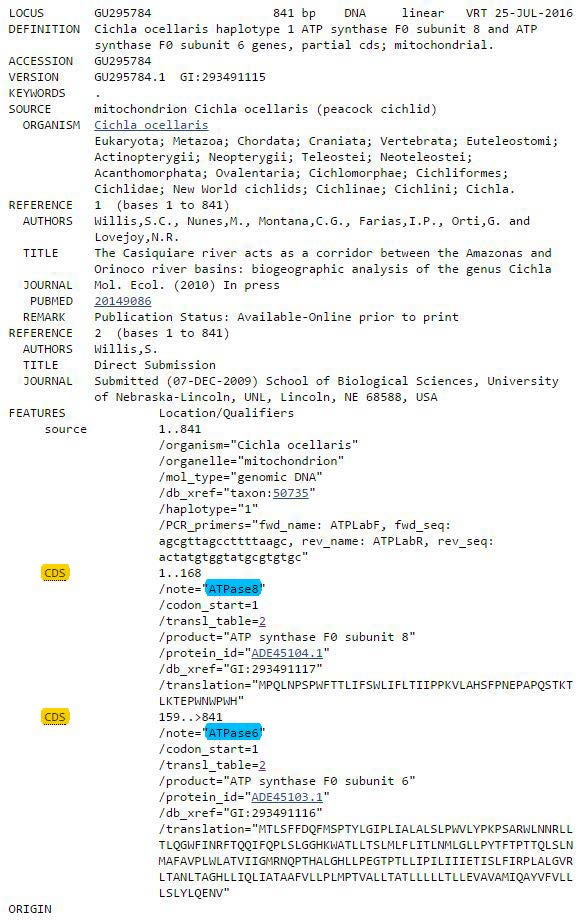

# 1: Introduction

This is a tutorial for using the R package AnnotationBustR. AnnotationBustR reads in sequences from GenBank and allows you to quickly extract specific parts and write them to FASTA files given a set of search terms. This is useful as it allows users to quickly extract parts of concatenated or genomic sequences based on GenBank features and write them to FASTA files, even when feature annotations for homologous loci may vary (i.e. gene synonyms like COI, COX1, COXI all being used for cytochrome oxidase subunit 1).

In this tutorial we will cover the basics of how to use AnnotationBustR to extract parts of a GenBank sequences.This is considerably faster than  extracting them manually and requires minimal effort by the user. While command line utilities like BLAST can also work, they require the buliding of databases to search against and can be computationally intensive and can have difficulties with highly complex sequences, like trans-spliced genes. They also require a far more complex query language to extract the subsequence and write it to a file. For example, it is possible to extract into FASTA files every subsequence from a mitochondrial genome (38 sequences, 13 CDS, 22 tRNA, 2rRNA, 1 D-loop) in  26-36 seconds, which is significantly faster than if you were to do it manually from the online GenBank features table. In this tutorial, we will discuss how to install AnnotationBustR, the basic AnnotationBustR pipeline, and how to use the functions that are included in AnnotationBustR.

# 2: Installation
## 2.1: Installation From CRAN
In order to install the stable CRAN version of the AnnotationBustR package:
```
install.packages("AnnotationBustR")
```
## 2.2: Installation of Development Version From GitHub
While we recommend use of the stable CRAN version of this package, we recommend using the package `devtools` to temporarily install the development version of the package from GitHub if for any reason you wish to use it :
```
#1. Install 'devtools' if you do not already have it installed:
install.packages("devtools")

#2. Load the 'devtools' package and temporarily install the development version of
#'AnnotationBustR' from GitHub:
library(devtools)
dev_mode(on=T)
install_github("sborstein/AnnotationBustR")  # install the package from GitHub
library(AnnotationBustR)# load the package

#3. Leave developers mode after using the development version of 'AnnotationBustR' so it will not remain on 
#your system permanently.
dev_mode(on=F)
```
# 3: Using AnnotationBustR
To load AnnotationBustR and all of its functions/data:
```
library(AnnotationBustR)
```
It is important to note that most of the functions within AnnotationBustR connect to sequence databases and require an internet connection.

##3.0: AnnotationBustR Work Flow
Before we begin a tutorial on how to use AnnotationBustR to extract sequences, lets first discuss the basic workflow of the functions in the package (Fig. 1). The orange box represents the step that occur outside of using AnnotationBustR. The only step you must do outside of AnnotationBustR is obtain a target list of accession numbers. This can be done either by downloading the accession numbers themselves from GenBank (http://www.ncbi.nlm.nih.gov/nuccore) or using R packages like `ape`, `seqinr` and `rentrez` to find accessions of interest in R. All boxes in blue in the graphic below represent steps that occur using AnnotationBustR. Boxes in green represent steps that are not mandatory, but may prove to be useful features of AnnotationBustR. In this tutorial, we will go through the steps in order, including the optional steps to show how to fully use the AnnotationBustR package.


```{r, out.width = "100%", echo=FALSE,fig.align='left',fig.cap= "Fig. 1: AnnotationBustR Workflow. Steps in orange occur outside the package while steps in blue are core parts of AnnotationBustR and steps in green represent optional steps"}

```

For this tutorial we will be extracting loci from the mitochondrial genomes of a fish genus, *Barbonymus*. We'll start off by using the R package `reutils` to search for accessions to use in this tutorial. There are a variety of R packages that can be used to find accessions you may want to extract subsequences from (i.e. `seqinr`,`rentrez`,`reutils`) or you can perform a search on the NCBI Database website (https://www.ncbi.nlm.nih.gov/nuccore) and download a list of accession numbers that can then be read into R.

```
#install (if necessary) and load reutils
#install.packages("reutils")#install if necessary
library(reutils)
```
Lets pretend we wanted to search for the gene cytochrome B. We could perform a search using the following.
```
#search for cytochrome b Barbonymus sequences
demo.search <- esearch(term = "Barbonymus[orgn] and CYTB[title]", db = 'nuccore', usehistory = TRUE)#search
accessions<-efetch(demo.search, rettype = "acc",retmode = "text")#fetch accessions
accessions <- strsplit(content(accessions), "\n")[[1]]#split out accessions from other meta-data
```
We can see that this returned 51 sequences. Many of these are accessions for a single cytochrome b sequence. However, if we wanted to find complete mitochondrial genomes to extract sequences from, we could refine our search to find complete mitochondrial genomes.
```
#perform the search and retrieve accessions of complete mitochondrial genomes for Barbonymus
demo.search <- esearch(term = "Barbonymus[orgn] and complete genome[title]", db = 'nuccore')#search
accessions<-efetch(demo.search, rettype = "acc",retmode = "text")#fetch accessions
accessions <- strsplit(content(accessions), "\n")[[1]]#split out accessions from other meta-data
#Currently, ACNUC, which AnnotationBustR uses through the seqinr dependency, doesn't have access to refseq 
#accessions, so remove them
accessions<-accessions[-grep("NC_",accessions)]
```
We can see that this returns six complete mitochondrial genome sequences on GenBank for *Barbonymus* species. We'll be using these accessions later in this tutorial.

One important note for using `reutils` for finding sequences is that if you are trying to retrieve over 500 accession numbers, you will get a warning that you need to write it to a file locally on the machine. In this case, you can use the folowing code below. As the file is local and not stored in R, you will need to read it back into R for use with AnnotationBustR. Luckily, this doesn't write meta-data to the file, so we don't have to run the line stripping the meta-data.

```
#Perform search given critera
demo.search <- esearch(term = "Pristimantis[orgn] and 12S[title]", db = 'nuccore', usehistory = TRUE) 
#As more than 500 records, write the records to file in the current working directory
accessions1<-efetch(demo.search, rettype = "acc",retmode  = "text", outfile = "12S.txt")
#Read in file with records, you can now use these in AnnotationBustR
accessions<-read.table("12S.txt",header = FALSE,stringsAsFactors = FALSE) 
```

## 3.1:(Optional Step) Finding the Longest Available
AnnotationBustR's `FindLongestSeq` function finds the longest available sequence for each species in a given set of GenBank accession numbers. All the user needs is to obtain a list of GenBank accession numbers they would like to input. The only function argument for `FindLongestSeq` is `Accessions`, which takes a vector of accession numbers as input. We can run the function below on the six Barbonymus accessions we found above by:

```
#Create a vector of GenBank nucleotide accession numbers. In order this contains accessions 
my.longest.seqs<-FindLongestSeq(accessions)#Run the FindLongestSeq function
my.longest.seqs#returns the longest seqs found per species
```
In this case we can see that the function worked as it only returned accession AP011317.1 (16577 bp) for *Barbonymus schwanefeldii* which was longer than accessions KU498040.2, KU233186.2, KJ573467.1  (16570,16478, and 16576 bp respectively) as well as the single accessions for *Barbonymus altus* and *Barbonymus gonionnotus*. The table returns a three-column data frame with the species name, the corresponding accession number, and the length.

## 3.2: Load a Data Frame of Search Terms of Gene Synonyms to Search With:
AnnotationBustR works by searching through the annotation features table for a locus of interest using search terms for it (i.e. possible synonyms it may be listed under). These search terms are formatted to have three columns:

- Locus: The name of the locus and the name of the FASTA of the file for that locus to be written. It is important that you use names that will not confuse R, so don't start these with numbers or include other characters like "." or "-" that R uses for math.
- Type: The type of sequence to search for. Can be one of CDS, tRNA, rRNA, misc_RNA, D-Loop, or misc_feature.
- Name: A possible synonym that the locus could be listed under.

For extracting introns and exons, an additional fourth column is needed (which will be discussed in more detail later in the tutorial):
-IntronExonNumber: The number of the intron or exon to extract

Below (Figure 2) is an example of where these corresponding items would be in the GenBank features table:
```{r, out.width = "100%", echo=FALSE, fig.align='left',fig.cap= "Fig. 2: GenBank features annotation for accession G295784.1 that contains ATP8 and ATP6. The words highlighted in yellow would fall under the column of Type. Here they are both CDS. The type of sequence is always listed farthest to the left in the features table. Colors in blue indicate terms that would be placed in the Name column, here indicating that the two CDS in this example are ATP8, labeled as ATPase8 and ATP6 respectively."}

```

So, if we wanted to use AnnotationBustR to capture these and write them to a FASTA, we could set up a data frame that looks like the following.
```{r, echo=FALSE}
ex.frame<-rbind(c("ATP8","CDS","ATPase8"),c("ATP6","CDS","ATPase6"))
colnames(ex.frame)<-c("Locus","Type","Name")
ex.frame<-as.data.frame(ex.frame)
print(ex.frame)
```

While AnnotationBustR will work with any data frame formatted as discussed above, we have included in it pre-made search terms for animal and plant mitochondrial DNA (mtDNA), chloroplast DNA (cpDNA), and ribosomal DNA (rDNA). These can be loaded from AnnotationBustR using:

```
#Load in pre-made data frames of search terms
data(mtDNAterms)#loads the mitochondrial DNA search terms for metazoans
data(mtDNAtermsPlants)#loads the mitochondrial DNA search terms for plants
data(cpDNAterms)#loads the chloroplast DNA search terms
data(rDNAterms)#loads the ribosomal DNA search terms
```
These data frames can also easily be manipulated to select only the loci of interest. For instance, if we were only interested in tRNAs from mitochondrial genomes, we could easily subset out the tRNAs from the premade `mtDNAterms` object by:

```
data(mtDNAterms)#load the data frame of mitochondrial DNA terms
tRNA.terms<-mtDNAterms[mtDNAterms$Type=="tRNA",]#subset out the tRNAs into a new data frame
```

## 3.3:(Optional Step) Merge Search Terms If Neccessary

While we have tried to cover as many synonyms for genes in our pre-made data frames, it is likely that some synonyms may not be represented due to the vast array of synonyms a single gene may be listed under in the features table. To solve this we have included the function `MergeSearchTerms`.

For example, let's imagine that we found a completely new annotation for the gene cytochrome oxidase subunit 1 (COI) listed as CX1. The `MergeSearchTerms` function only has two arguments, `...`, which takes two or more objects of class `data.frame` and  the logical `Sort.Genes`, which We could easily add this to other mitochondrial gene terms by:

```
#Add imaginary gene synonym for cytochrome oxidase subunit 1, CX1
add.name<-data.frame("COI","CDS", "CX1", stringsAsFactors = FALSE)
colnames(add.name)<-colnames(mtDNAterms)#make the columnames for this synonym those needed for AnnotationBustR

#Run the merge search term function without sorting based on gene name.
new.terms<-MergeSearchTerms(add.name, mtDNAterms, SortGenes=FALSE)

#Run the merge search term function with sorting based on gene name.
new.terms<-MergeSearchTerms(add.name, mtDNAterms, SortGenes=TRUE)
```
We will use this function again in a more realistic example later in this vignette.

## 3.4 Extract sequences with AnnotationBust
The main function of AnnotationBustR is `AnnotationBust`. This function extracts the sub-sequence(s) of interest from the accessions and writes them to FASTA files in the current working directory. In addition to writing sub-sequences to FASTA files, `AnnotationBust` also generates an accession table for all found sub-sequences written to FASTA files which can then be written to a csv file using base R `write.csv`. AnnotationBustR requires at least two arguments, a vector of accessions for `Accessions` and a data frame of search terms formatted as discussed in 3.2 and 3.3 for `Terms`.

Additional arguments include the ability to specify duplicate genes you wish to recover as a vector of gene names using the `Duplicates` argument and specifying the number of duplicate instances to extract using a numeric vector (which must be the same length as `Duplicates`) using the `DuplicateInstances` argument.

AnnotationBustR also has arguments to translate coding sequences into the corresponding peptide sequence setting the `TranslateSeqs` argument to TRUE. If `TranslateSeqs=TRUE`, users should also specify the GenBank translation code number corresponding to their sequences using the `TranslateCode` argument. A list of GenBank translaton codes for taxa is available here: http://www.ncbi.nlm.nih.gov/Taxonomy/Utils/wprintgc.cgi

An additional argument of `AnnotationBust` is `DuplicateSpecies` which when set to `DuplicateSpecies=TRUE` adds the accession number to the species name for the FASTA file. This can be useful for later analyses involving FASTA files as duplicate names in FASTA headers can pose problems with some programs. It is important to note that if users select `DuplicateSpecies=TRUE` that while FASTA file will contain species names with their respected accession number, the corresponding accession table will either have a single row per species containing all the accession numbers for each subsequence locus found for that species seperated by a comma or a seperate row for each accession number dependent on what the user chooses for the `TidyAccessions` argument (see description below).

The argument `Prefix`can either be `NULL` or a character vector of length 1. If Prefix is not `NULL` it will add the prefix specified to all FASTA files. If left as `Prefix=NULL` files names will just be the name of the locus.

The final argument `TidyAccessions` effects the format of the final accession table. If `TidyAccessions=TRUE`, all sequence for a single species will be collapsed into a single cell per locus and accessions will be seperated by commas. If `TidyAccessions=FALSE` it will leave each accession number in its own row in the accession table. 

For the tutorial, we will use the accessions we created in examples 3.1 in the object `my.longest.accessions`. This is a vector that contains three accessions for mitogenomes of three species of *Barbonymus*. These accessions provide a good highlight as to the utility of this package.If we look at the annotations of these three accessions(https://www.ncbi.nlm.nih.gov/nuccore/AP011317.1,https://www.ncbi.nlm.nih.gov/nuccore/AP011181.1,https://www.ncbi.nlm.nih.gov/nuccore/AB238966.1), we can see that while AP011317 and AP011181 are annotated with similar nomenclature, AB238966 differs substantially (e.x. COI vs CO2, Cyt b vs Cb, etc.). For this example, we will use all the arguments of `AnnotationBust` to extract all 38 subsequences for the four accessions (22 tRNAs, 13 CDS, 2 rRNAs, and 1 D-loop). For this we will have to specify duplicates, in this case for tRNA-Leu and tRNA-Ser, which occur twice in vertebrate mitogenomes. We will translate the CDS using `TranslateSeqs` argument with `TranslateCode=2`, the code for vertebrate mitogenomes. Because we have a single accession for each species, we will specify `DuplicateSpecies=FALSE` and have out FASTA files output with the prefix "Demo" by specifying `Prefix="Demo"` and with `TiddyAccessions=TRUE`. This will create 38 FASTA files for all mitochondrial loci in the mitochondrial genome in the working director with the prefix "Demo".

```
#run AnnotationBust function for two duplicate tRNA genes occuring twice and translate CDS
my.seqs<-AnnotationBust(Accessions=my.longest.seqs$Accession, Terms=mtDNAterms,Duplicates=c("tRNA_Leu","tRNA_Ser"), DuplicateInstances=c(2,2), TranslateSeqs=TRUE, TranslateCode=2, DuplicateSpecies=TRUE, Prefix="Demo", TidyAccessions=TRUE)

#We can return the accession table and write it to a CSV file.
my.seqs#retutn the accession table
write.csv(my.seqs, file="AccessionTable.csv")#Write the accession table to a csv file
```

We can also use `AnnotationBustR` to extract introns from sequences. One limitation to this is that the introns must be annotated within the subsequence, which is lacking from some accessions (e.x. not all chloroplasts have introns annotated). As stated above, this requires the use of a fourth column in the search terms, labelled `IntronExonNumber`, which is used to find which number intron is to be extracted. For instance, lets imagine we want to extract the coding sequence matK and exon 2 and intron 1 of trnK from the chloroplast genomes KX687911.1 and KX687910.1 We could set up the search terms as follows using the current `cpDNAterms`:

```
#Subset out matK from cpDNAterms
cds.terms<-subset(cpDNAterms,cpDNAterms$Locus=="matK")
#Create a vecotr of NA so we can merge with the search terms for introns and exons
cds.terms<-cbind(cds.terms,(rep(NA,length(cds.terms$Locus))))
colnames(cds.terms)[4]<-"IntronExonNumber"

#Prepare a search term table for the intron and exons to remove
#We can start with the cpDNAterms for trnK
IntronExon.terms<-subset(cpDNAterms,cpDNAterms$Locus=="trnK")
#As we want to go for two exons, we will want the synonyms repeated as we are doing and intron and an exon
IntronExon.terms<-rbind(IntronExon.terms,IntronExon.terms)#duplicate the terms
IntronExon.terms$Type<-rep(c("Intron","Intron","Exon","Exon"))#rep the sequence type we want to extract
IntronExon.terms$Locus<-rep(c("trnK_Intron","trnK_Exon2"),each=2)
IntronExon.terms<-cbind(IntronExon.terms,rep(c(1,1,2,2)))#Add intron/exon number info
colnames(IntronExon.terms)[4]<-"IntronExonNumber"#change column name for number info for IntronExon name

#We can then merge everything together with MergeSearchTerms terms
IntronExonExampleTerms<-MergeSearchTerms(IntronExon.terms,cds.terms)

#Run AnnotationBust
IntronExon.example<-AnnotationBust(Accessions=c("KX687911.1", "KX687910.1"), Terms=IntronExonExampleTerms, Prefix="DemoIntronExon")
```
## 3.5 Troubleshooting
As `AnnotationBustR` is dependent on access to online databases, it is important that you make sure you have a reliable internet connection while using the package, especially for the `FindLongestSeq` and `AnnotationBust` functions. Additionally, as these functions require access to GenBank and ACNUC, if you have internet access yet are still having issues, check that these sites and there servers are not down or undergoing maintainence, which they do occasionally.

The `AnnotationBust` function may also provide the following warnings and report the following in the accessions table:

"Acc. # Not Found" = The supplied accession number does not seem to exist, check that it is correct.

"Acc. # Not On ACNUC GenBank" = Sometime ACNUC is behind a day or two from NCBI GenBank. To double check the date for the current version of the ACNUC database you can run the following code:

```
ACNUC.GB.Info<-seqinr::choosebank("genbank", infobank=T)
ACNUC.GB.INFO#return info on date
```

"type not fully Ann." = Indicates that the sequence is on GenBank, but is lacking necessary annotation information to fully extract all subsequences. They may be concatenated and not contain position information for each subsequence.

"Warning: In socketConnection(host = host, port = port, server = server, blocking = blocking, :pbil.univ-lyon1.fr:5558 cannot be opened" = There was an issue connecting to ACNUC. This is an error with the seqinr dependency indicating it is having issues connecting to the ACNUC server. This isn't usually common with a solid internet connection, but does occassionally occur when trying to connect to the ANCUC server for the first time during a session.


It is also important to note that refseq numbers are not supported at the moment (i.e. prefixes like XM_ and NC_). This is due to a limitation in our dependency `seqinr`, which only provides access to refseq viruses at present. We have been in contact with the maintainers of `seqinr` and look forward to implementing refseq accessability into AnotationBusR in the future.

## 4: Final Comments
Further information on the functions and their usage can be found in the helpfiles `help(package=AnnotationBustR)`. For any further issues and questions send an email with subject 'AnnotationBustR support' to sborstei@vols.utk.edu or post to the issues section on GitHub(https://github.com/sborstein/AnnotationBustR/issues).
